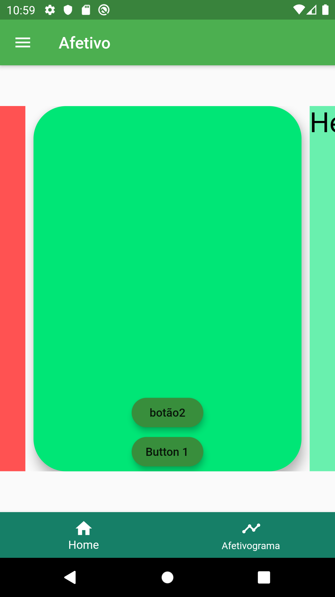
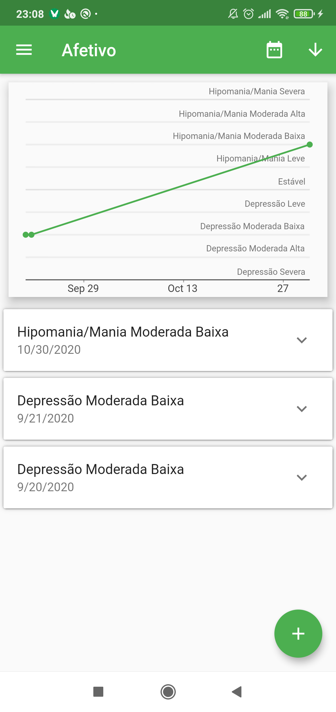
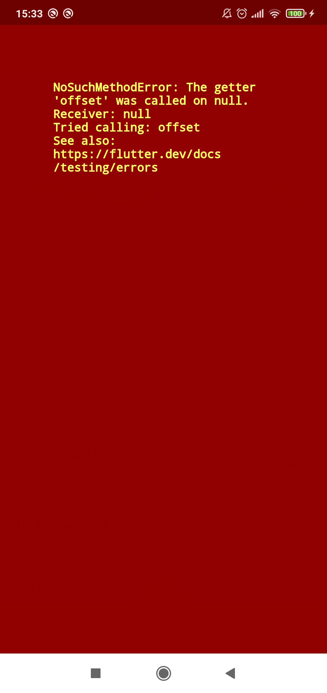
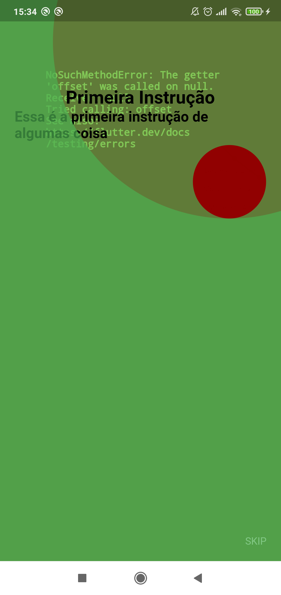

# 📱 Afetivo - Aplicativo de Automonitoramento de Humor

<p align="center">
  
  
  
  
</p>

## 🧠 Sobre o Projeto

O **Afetivo** é um aplicativo de automonitoramento de humor baseado no método **National Institute of Mental Health Life Chart Method (NIMH-LCM)** em sua versão autoaplicável e prospectiva. O objetivo principal é oferecer uma ferramenta eficiente para pacientes e profissionais da saúde mental acompanharem oscilações de humor de forma prática e sistemática.

O aplicativo foi desenvolvido para auxiliar no monitoramento diário de estados emocionais, permitindo o registro de eventos importantes, uso de medicações, ciclos do sono, entre outros fatores relevantes para a saúde mental. O **Afetivo** é uma solução complementar em tratamentos clínicos, facilitando o autoconhecimento e a comunicação entre pacientes e profissionais.

## 🚀 Recursos Principais

- Registro diário do humor com diferentes níveis de intensidade.
- Notificações para lembretes de monitoramento.
- Acompanhamento de eventos de vida, uso de medicamentos e ciclos de sono.
- Geração de relatórios em PDF para acompanhamento clínico.
- Interface intuitiva e fácil de usar.

## 📥 Como Baixar e Executar o Projeto

### 1️⃣ Pré-requisitos

- [Flutter](https://flutter.dev/docs/get-started/install) instalado em sua máquina.
- Android Studio ou emulador iOS configurado.

### 2️⃣ Clonando o Repositório

```bash
git clone https://github.com/daltonbc96/afetivo.git
cd afetivo
```

### 3️⃣ Instalando Dependências

```bash
flutter pub get
```

### 4️⃣ Executando o Aplicativo

Para rodar em um dispositivo Android ou emulador:

```bash
flutter run
```

Se estiver utilizando um dispositivo iOS:

```bash
flutter run -d ios
```

## 📦 Download do Aplicativo (Release para Android)

A versão mais recente do Afetivo está disponível para dispositivos Android. Você pode baixá-la diretamente no link abaixo:

[📥 Download do Afetivo v1.0.2](https://github.com/daltonbc96/afetivo/releases/tag/v1.0.2)

Após o download, basta instalar o arquivo APK em seu dispositivo Android.

## 📁 Estrutura do Projeto

```
afetivo/
├── android/
├── assets/
│   ├── images/
│   └── fonts/
├── ios/
├── lib/
│   ├── models/
│   ├── pages/
│   ├── services/
│   ├── stores/
│   └── widgets/
└── test/
```

## 🤝 Contribuindo

Contribuições são bem-vindas! Para contribuir:

1. **Fork** o repositório.
2. Crie uma **branch** para sua feature: `git checkout -b minha-nova-feature`
3. Faça suas alterações e commit: `git commit -m 'Adiciona nova feature'`
4. Envie para o GitHub: `git push origin minha-nova-feature`
5. Abra um **Pull Request**.

## 🔒 Licença

Este projeto está licenciado sob a [MIT License](LICENSE).

## 👥 Autores

Desenvolvido por Dalton Breno Costa e colaboradores da área de Psicologia e Engenharia de Computação.
